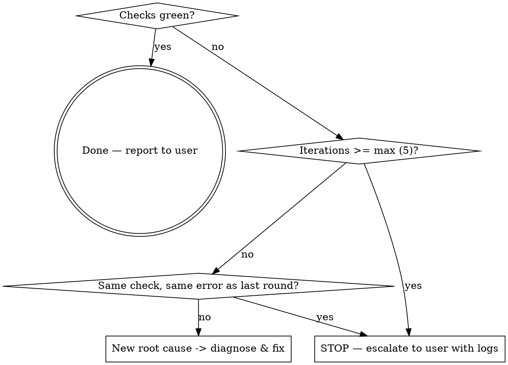

# Fixing PR Checks

## Overview

Drive a **diagnose → fix → push → watch** loop until a pull request's CI checks pass. You orchestrate the loop; subagents do the log-reading and editing so your own context stays clean.

**Core principle:** every iteration must change code based on a fresh diagnosis. Never push the same code twice, and never start another round without a new hypothesis. A loop that pushes hope instead of a fix runs forever.

## When to use

- A PR has red / failing checks (GitHub Actions, required status checks)
- "Fix CI on this branch", "make the checks pass"
- A check that was green now fails after a push

**When NOT to use:**
- No PR or no CI configured — just run the tests locally
- The failure is flaky / infra (network blip, runner died) — re-run the job, don't "fix" code. Confirm it reproduces before changing anything.
- You are pushing directly to `main` — this skill assumes a PR branch you can add commits to.

## Workflow

1. **Identify the PR and its failing checks.**
   - No arg uses the current branch's PR: `gh pr view --json number,headRefName`. If ambiguous or none, ask the user for the PR number.
   - `gh pr checks <pr-or-branch> --json name,state,bucket,link` — failing checks have `bucket: "fail"`. Record each failing check's name and link.

2. **Pull the failing logs (targeted, not the whole run).**
   - Get the run id from the check `link`, or list runs: `gh run list --branch <branch> --json databaseId,name,conclusion -L 20`.
   - `gh run view <run-id> --log-failed` — prints only the failed steps. Much smaller than `--log`.

3. **Diagnose with a subagent (read-only).**
   - Dispatch `Explore` or `general-purpose`. Brief it like a colleague: the failing check name, the `--log-failed` output, the repo path. Ask for **root cause, exact files/lines, and a concrete fix plan — not an applied fix.**
   - Read the diagnosis yourself and confirm it actually explains the failure. **Do not delegate this understanding** — you write the next subagent's instructions.

4. **Implement the fix with a second subagent.**
   - Dispatch `general-purpose` with **specific** instructions from the diagnosis: which files, what to change, why. Never say "fix it based on the findings."
   - Review the diff it returns before committing.

5. **Commit and push.**
   - Stage changed files **by name** (not `git add -A`). Commit with a message describing the fix. `git push`.
   - Never force-push, never amend a pushed commit, never push to `main`.

6. **Watch the checks.**
   - `gh pr checks <pr> --watch --fail-fast` blocks until checks settle and exits nonzero on failure.
   - Green → done. Failing → return to step 2 with **fresh** logs (the error may have changed).

## Loop control

Default cap: **5 iterations.** If the same check fails twice with the same error, the fix isn't working — stop and report to the user with the logs rather than spinning.

## Quick reference

| Goal | Command |
|------|---------|
| PR for current branch | `gh pr view --json number,headRefName,url` |
| Check status (machine-readable) | `gh pr checks <pr> --json name,state,bucket,link` |
| List recent runs on branch | `gh run list --branch <branch> --json databaseId,name,conclusion -L 20` |
| Failed-step logs only | `gh run view <run-id> --log-failed` |
| Re-run only failed jobs (flaky) | `gh run rerun <run-id> --failed` |
| Watch until checks settle | `gh pr checks <pr> --watch --fail-fast` |

## Common mistakes

- **Looping without a new diagnosis** — pushing the same idea hoping CI flips. Require a changed hypothesis each round; if you don't have one, stop.
- **Pulling full run logs into your own context** — use `--log-failed` and let the diagnosis subagent read the detail.
- **Delegating understanding** — handing the fixer "fix based on findings." You read the diagnosis and write specific instructions.
- **Treating flaky/infra failures as code bugs** — reproduce first; re-run the job if it's infra.
- **Force-pushing or amending pushed commits to "retry"** — add new commits instead.
